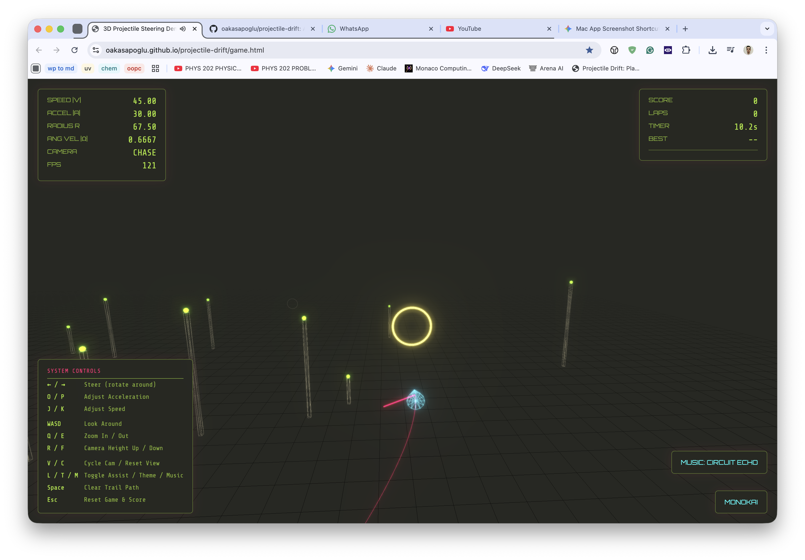
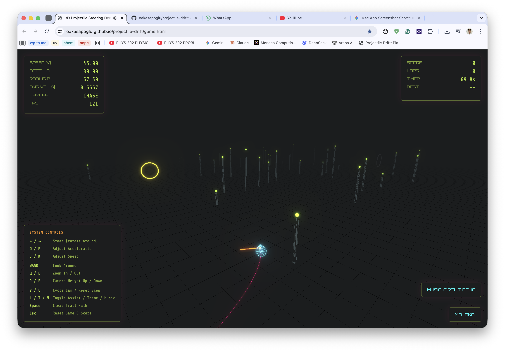
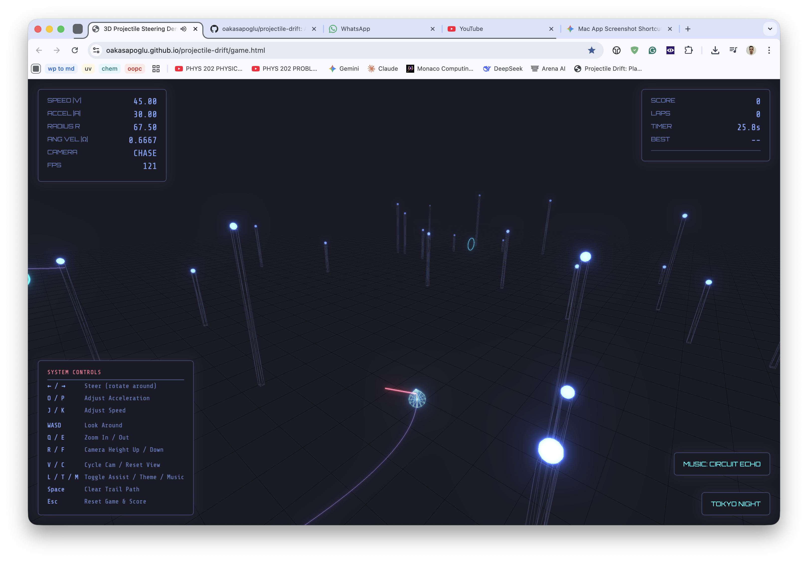
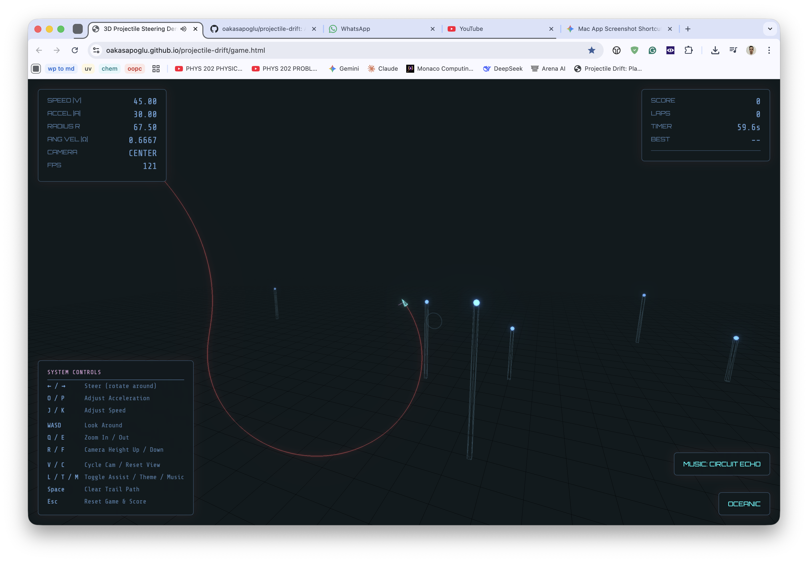
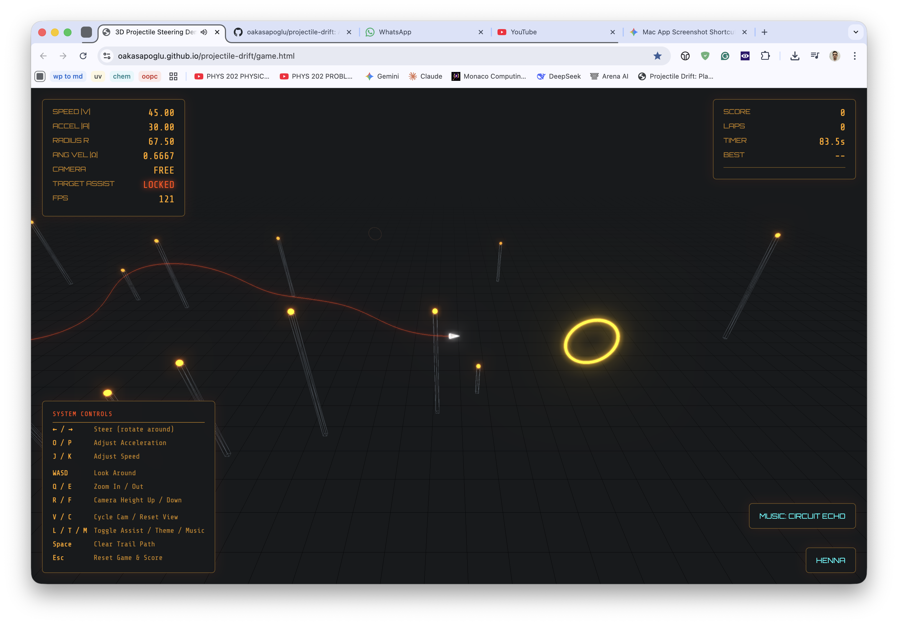

# Projectile Steering Demo

A 3D physics simulation built with Three.js. This project demonstrates a constant-speed projectile where steering is achieved by rotating the acceleration vector.

[Projectile Drift: Play it!](https://oakasapoglu.github.io/projectile-drift/game.html)

## Project History & Development

This project originated as a port of a 3D projectile simulation from python to JS, see [weird-bazooka](https://github.com/hikasap/weird-bazooka). The development followed an AI-augmented workflow:

1.  **Specification**: The core logic and physics requirements were defined in `desing.md`.
2.  **Prototyping**: Using the design specs, Claude Opus was utilized to generate a comprehensive, single-file HTML prototype.
3.  **Iterative Refinement**: The codebase underwent extensive debugging and expansion. Features like the modular theme system, and integrated audio were added to evolve the prototype into the current version.

## Features
- Constant-speed motion logic.
- Multiple visual themes.
- Interactive HUD with physics metrics.
- Support for custom music tracks.

## Controls
- **Arrows**: Steer the projectile.
- **J/K**: Adjust Speed.
- **O/P**: Adjust Acceleration.
- **V**: Cycle Camera Modes.
- **L**: Toggle Target Assist.
- **T**: Cycle Themes.
- **M**: Cycle Music.

## How it works

The physics is based on the following principles:

- $|v| = \text{const}$
- $|a| = \text{const}$ and $a \perp v$
- $w = v \times a$
- Radius of curvature $r = \frac{|v|^2}{|a|}$

Because $a$ only changes direction via rotation around $v$, the projectile behaves like a steerable centripetal system—perfect for futuristic homing shots or ribbon-like trails.
